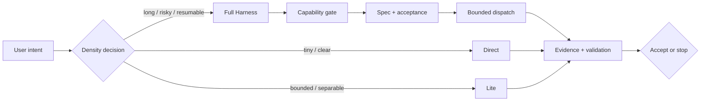

# Agent Reliability Harness

[简体中文](README.zh-CN.md) | English

> A policy-driven execution harness for reliable, cost-aware AI coding agents.

Agent Reliability Harness helps an agent choose the smallest process that can complete a task safely. It routes work across Direct, Lite, and Full modes; dispatches only when delegation pays for itself; and accepts completion only when evidence supports it.

Current version: **v7.0.0** · 2026-07-14

## Why this exists

Most agent failures are not caused by a lack of raw model capability. They come from the surrounding execution system:

- a tiny task is turned into expensive coordination ceremony;
- a fuzzy goal is implemented before success is made executable;
- a worker says “done” without verifiable evidence;
- a long run loses state after a timeout, conflict, or context reset;
- a requested model is recorded as if it were the model that actually ran.

This project treats that surrounding system as a first-class engineering surface: a reliability harness around the model.

## What it guarantees

| Guarantee | Mechanism |
| --- | --- |
| Proportional process | Direct, Lite, and Full mode selection happens before delegation. |
| Bounded delegation | Every worker has an owner, scope, output contract, and stop condition. |
| Honest completion | Acceptance requires external evidence; self-report is not proof. |
| Resumable execution | Full runs persist state, trace, reports, budgets, and acceptance records. |
| Model accountability | Requested, resolved, runtime, profile, and escalation data are recorded separately. |
| Safe fallback | Missing capabilities, conflicts, and repeated failures produce an explicit fallback or stop state. |

## How it works



The manager remains responsible for intent compilation, ownership, merge decisions, and final acceptance. A request to use multiple agents authorizes the manager to evaluate delegation; it does not require a worker for every task.

## Execution modes

| Mode | Use it when | What is created |
| --- | --- | --- |
| **Direct** | The task is small, local, sequential, or cheaper for one agent. | No harness files; implement and verify in the current thread. |
| **Lite** | The work has a few clean slices but does not need durable recovery. | A compact plan, bounded ownership, short reports, and targeted checks. |
| **Full** | The work is long, risky, resumable, parallel, evaluator-sensitive, or benefits from isolation. | Durable state, task specs, acceptance registry, trace, reports, budgets, and verification gates. |

The decision rule is simple: coordination must reduce more risk than it adds in context, latency, and integration cost.

## Cost-aware model routing

Model choice happens **after** density selection. A cheaper worker never justifies dispatch for a one-line task.

### Codex policy

| Profile | Model | Reasoning | Use |
| --- | --- | --- | --- |
| `fast` | GPT-5.6 Luna | `medium` | Simple, mechanically verifiable work. |
| `main` | GPT-5.6 Luna | `xhigh` | Default high-frequency manager and executor. |
| `planner` | GPT-5.6 Sol | `high` | Fuzzy goals, architecture, harness design, and synthesis. |
| `critical_reviewer` | GPT-5.6 Sol | `xhigh` | High risk, worker conflict, or repeated validation failure. |

Terra is intentionally excluded from the configured Codex policy. Use the deterministic selector when the route is unclear:

```bash
python3 scripts/model_router.py --simple --mechanically-verifiable
python3 scripts/model_router.py --harness-synthesis
python3 scripts/model_router.py --validation-failures 2
```

The profile vocabulary is portable, but model availability is runtime-specific. Claude Code, Grok, and other adapters must report their own mapping or safe fallback; the harness never claims a model switch that the runtime did not confirm.

## Install as a Codex skill

The repository is the source of truth. The runtime package intentionally excludes repository-only docs, caches, generated workspaces, and private configuration.

```bash
git clone https://github.com/SUNRNEHUI/agent-reliability-harness.git
cd agent-reliability-harness

python3 scripts/sync_version.py --fix --date 2026-07-14
python3 scripts/package_skill.py --verify-source
python3 scripts/package_skill.py \
  --output /tmp/agent-reliability-harness-runtime \
  --force

mkdir -p ~/.codex/skills/agent-reliability-harness
rsync -a --delete \
  /tmp/agent-reliability-harness-runtime/ \
  ~/.codex/skills/agent-reliability-harness/

python3 scripts/package_skill.py --check \
  ~/.codex/skills/agent-reliability-harness
```

Then invoke it when the task has an explicit multi-agent, delegation, worktree, DAG, resumability, or evidence-risk trigger:

```text
$agent-reliability-harness
```

## Full Harness at a glance

Full mode is deliberately explicit. A run normally contains:

```text
workspace/<run-slug>/
├── task_spec.md              # executable goal, constraints, and stop conditions
├── acceptance_registry.json  # criteria and pass algorithms
├── run_state.json            # lifecycle, tasks, routing, and session state
├── progress.md               # compact human-readable ledger
├── trace.jsonl               # append-only manager trace
├── tdd_trace.jsonl           # test-first or substitute-verification trace
├── capability_snapshot.md    # runtime capabilities and fallbacks
├── tasks/                    # bounded worker contracts
└── reports/                  # worker and evaluator reports
```

Completion is blocked when required acceptance is pending, evidence is missing or stale, a protected dispatch is only a chat claim, or the run exceeds a defined stop condition.

## Runtime support

| Runtime | Role | Notes |
| --- | --- | --- |
| Codex | First-class adapter | Supports the configured profile table and durable dispatch records. |
| Claude Code | Portable adapter | Uses the same protocol; model selection follows the active runtime. |
| Grok and other agents | Universal adapter | Capability checks and safe fallback are required. |

This is a protocol and skill package, not a hosted agent service. It does not replace the model runtime, sandbox, approval system, or repository CI.

## Repository layout

```text
SKILL.md                 # trigger rules and manager protocol
master-prompt.md         # manager-facing prompt
sub-prompt.md            # bounded worker contract
agents/                  # runtime entry metadata
adapters/                # Codex, Claude Code, and universal mappings
references/              # deeper protocol and evaluation guidance
templates/               # Lite and Full artifact shapes
scripts/                 # initialization, routing, validation, status, packaging
README.md                # public English documentation
README.zh-CN.md          # public Chinese documentation
```

## Development and verification

The project uses Python's standard library for its runtime scripts. Before opening a change:

```bash
python3 -m py_compile scripts/*.py
python3 -m json.tool templates/run_state.json >/dev/null
python3 -m json.tool templates/acceptance_registry.json >/dev/null
python3 scripts/test_runtime_behavior.py
python3 scripts/package_skill.py --verify-source
python3 scripts/package_skill.py --output /tmp/agent-reliability-harness-runtime --force
python3 scripts/package_skill.py --check /tmp/agent-reliability-harness-runtime
git diff --check
```

When runtime behavior changes, add or update a behavioral test first. When public behavior or version changes, keep this README and `README.zh-CN.md` structurally aligned.

## Migration from the previous name

`Agent Dispatch Harness` and the earlier `Multi-Agent Dispatcher` name are retired public names. Existing installations should be moved to the new directory so Codex does not discover duplicate skills:

```bash
rsync -a --delete \
  /tmp/agent-reliability-harness-runtime/ \
  ~/.codex/skills/agent-reliability-harness/
rm -rf ~/.codex/skills/agent-dispatch-harness
rm -rf ~/.codex/skills/multi-agent-dispatcher
rm -rf ~/.codex/skills/multi-agent-orchestrator
```

The old GitHub repository URL redirects to the renamed repository after the migration.

## Contributing

Good contributions make the harness more reliable without making every task heavier. Prefer:

- a failing behavioral case before a protocol or validator change;
- the smallest mode that preserves evidence quality;
- explicit ownership and bounded reports for parallel work;
- documentation changes that stay synchronized in English and Chinese;
- reproducible commands and honest unresolved risks.

## Further reading

- [Harness protocol](references/harness-protocol.md)
- [Cost-aware model routing](references/model-routing.md)
- [Proportionality guide](references/proportionality.md)
- [Spec Synthesis](references/spec-synthesis.md)
- [Evaluation cases](references/eval_cases.md)
- [TDD gates](references/tdd-gates.md)
