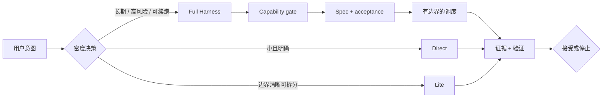

# Agent Reliability Harness

[English](README.md) | 简体中文

> 面向可靠、低成本 AI 编码代理的策略驱动执行 Harness。

Agent Reliability Harness 帮助代理选择“能够可靠完成任务的最轻流程”。它在 Direct、Lite、Full 之间做密度决策，只在调度收益高于协调成本时分配子代理，并且只有在证据充分时才接受完成结论。

当前版本：**v7.0.0** · 2026-07-14

## 为什么需要它

许多 Agent 失败并不是模型能力不足，而是外围执行系统不可靠：

- 一个小任务被包装成昂贵的协调仪式；
- 目标含糊时直接写代码，没有把成功条件变成可执行规则；
- worker 自称完成，却没有可复核证据；
- 长任务在超时、冲突或上下文重置后丢失状态；
- 记录了请求模型，却没有区分实际解析和运行的模型。

本项目把这层外围系统当作一等工程对象：围绕模型建立可靠性 Harness。

## 它保证什么

| 保证 | 实现方式 |
| --- | --- |
| 流程按比例 | 调度前先选择 Direct、Lite 或 Full。 |
| 调度有边界 | 每个 worker 都有 owner、范围、输出契约和停止条件。 |
| 完成结论诚实 | 验收必须依赖外部证据，自报不能作为证明。 |
| 任务可续跑 | Full run 持久化状态、trace、报告、预算和验收记录。 |
| 模型可审计 | 分开记录 requested、resolved、runtime、profile 和 escalation。 |
| 失败可回退 | 能力缺失、冲突和重复失败会产生明确回退或停止状态。 |

## 工作方式



主代理始终负责意图编译、责任边界、合并决策和最终验收。用户提到多智能体，只代表主代理获得评估调度的授权，并不意味着每个任务都必须启动 worker。

## 执行模式

| 模式 | 适用场景 | 会创建什么 |
| --- | --- | --- |
| **Direct** | 任务小、局部、顺序性强，或一个代理完成更划算。 | 不创建 Harness 文件，直接执行并验证。 |
| **Lite** | 有少量边界清晰的切片，但不需要持久化恢复。 | 简短计划、明确 owner、紧凑报告和针对性检查。 |
| **Full** | 长任务、高风险、可续跑、需要并行/evaluator，或需要隔离。 | 持久化状态、任务规范、验收清单、trace、报告、预算和验证 gate。 |

决策原则很简单：协调带来的风险降低必须大于它引入的上下文、延迟和整合成本。

## 成本感知模型路由

模型选择发生在密度决策之后。一个便宜的 worker 不能成为为一行代码启动调度的理由。

### Codex 策略

| Profile | 模型 | Reasoning | 用途 |
| --- | --- | --- | --- |
| `fast` | GPT-5.6 Luna | `medium` | 简单、可机械验证的工作。 |
| `main` | GPT-5.6 Luna | `xhigh` | 默认高频主代理和执行者。 |
| `planner` | GPT-5.6 Sol | `high` | 含糊目标、架构、Harness 设计和 Spec Synthesis。 |
| `critical_reviewer` | GPT-5.6 Sol | `xhigh` | 高风险、worker 冲突或连续验证失败。 |

当前 Codex 策略明确排除 Terra。路由不明确时，运行确定性选择器：

```bash
python3 scripts/model_router.py --simple --mechanically-verifiable
python3 scripts/model_router.py --harness-synthesis
python3 scripts/model_router.py --validation-failures 2
```

Profile 名称可以跨运行时复用，但模型可用性由具体 adapter 决定。Claude Code、Grok 等运行时必须报告自己的映射或安全回退；Harness 不会把未经运行时确认的模型切换说成事实。

## 安装为 Codex Skill

仓库是源码唯一事实来源。runtime 包会排除仓库文档、缓存、生成工作区和私有配置。

```bash
git clone https://github.com/SUNRNEHUI/agent-reliability-harness.git
cd agent-reliability-harness

python3 scripts/sync_version.py --fix --date 2026-07-14
python3 scripts/package_skill.py --verify-source
python3 scripts/package_skill.py \
  --output /tmp/agent-reliability-harness-runtime \
  --force

mkdir -p ~/.codex/skills/agent-reliability-harness
rsync -a --delete \
  /tmp/agent-reliability-harness-runtime/ \
  ~/.codex/skills/agent-reliability-harness/

python3 scripts/package_skill.py --check \
  ~/.codex/skills/agent-reliability-harness
```

当任务明确涉及多智能体、委托、worktree、DAG、可续跑或证据风险时调用：

```text
$agent-reliability-harness
```

## Full Harness 一览

Full 模式保持显式和可审计。一次 run 通常包含：

```text
workspace/<run-slug>/
├── task_spec.md              # 可执行目标、约束和停止条件
├── acceptance_registry.json  # 验收标准和 pass algorithm
├── run_state.json            # 生命周期、任务、路由和 session 状态
├── progress.md               # 紧凑的人类可读进度
├── trace.jsonl               # 追加写入的 manager trace
├── tdd_trace.jsonl           # test-first 或替代验证 trace
├── capability_snapshot.md    # 运行时能力和回退
├── tasks/                    # 有边界的 worker 契约
└── reports/                  # worker 和 evaluator 报告
```

当必需验收仍为 pending、证据缺失或过期、受保护 dispatch 只有聊天声明，或 run 触发停止条件时，完成结论会被阻断。

## 运行时支持

| 运行时 | 角色 | 说明 |
| --- | --- | --- |
| Codex | 一等 adapter | 支持当前 profile 表和持久化 dispatch 记录。 |
| Claude Code | 可移植 adapter | 复用同一协议，模型选择遵循实际运行时。 |
| Grok 和其他 Agent | Universal adapter | 必须先做能力检查并记录安全回退。 |

这是一个协议和 Skill 包，不是托管式 Agent 服务。它不替代模型运行时、sandbox、审批系统或仓库 CI。

## 仓库结构

```text
SKILL.md                 # 触发规则和主代理协议
master-prompt.md         # manager prompt
sub-prompt.md            # 有边界的 worker 契约
agents/                  # 运行时入口元数据
adapters/                # Codex、Claude Code 和 universal 映射
references/              # 深入协议和评估说明
templates/               # Lite / Full artifact 模板
scripts/                 # 初始化、路由、校验、状态和打包
README.md                # 英文公开文档
README.zh-CN.md          # 中文公开文档
```

## 开发与验证

运行时脚本只使用 Python 标准库。提交变更前运行：

```bash
python3 -m py_compile scripts/*.py
python3 -m json.tool templates/run_state.json >/dev/null
python3 -m json.tool templates/acceptance_registry.json >/dev/null
python3 scripts/test_runtime_behavior.py
python3 scripts/package_skill.py --verify-source
python3 scripts/package_skill.py --output /tmp/agent-reliability-harness-runtime --force
python3 scripts/package_skill.py --check /tmp/agent-reliability-harness-runtime
git diff --check
```

运行时行为变更应先新增或更新行为测试。公开行为或版本变更时，英文和中文 README 必须保持结构同步。

## 从旧名称迁移

`Agent Dispatch Harness` 和更早的 `Multi-Agent Dispatcher` 已退出公开使用。已有安装应迁移到新目录，避免 Codex 发现重复 Skill：

```bash
rsync -a --delete \
  /tmp/agent-reliability-harness-runtime/ \
  ~/.codex/skills/agent-reliability-harness/
rm -rf ~/.codex/skills/agent-dispatch-harness
rm -rf ~/.codex/skills/multi-agent-dispatcher
rm -rf ~/.codex/skills/multi-agent-orchestrator
```

GitHub 仓库重命名后，旧 URL 会自动跳转到新仓库。

## 贡献方式

好的贡献应提升 Harness 可靠性，而不是让所有任务都变重。优先：

- 在协议或校验器变更前新增失败行为用例；
- 选择仍能保证证据质量的最轻模式；
- 并行工作使用明确 owner 和有边界的报告；
- 英文和中文文档同步；
- 提供可复现命令，并诚实记录未解决风险。

## 深入阅读

- [Harness 协议](references/harness-protocol.md)
- [成本感知模型路由](references/model-routing.md)
- [按比例执行指南](references/proportionality.md)
- [Spec Synthesis](references/spec-synthesis.md)
- [评估用例](references/eval_cases.md)
- [TDD Gate](references/tdd-gates.md)
